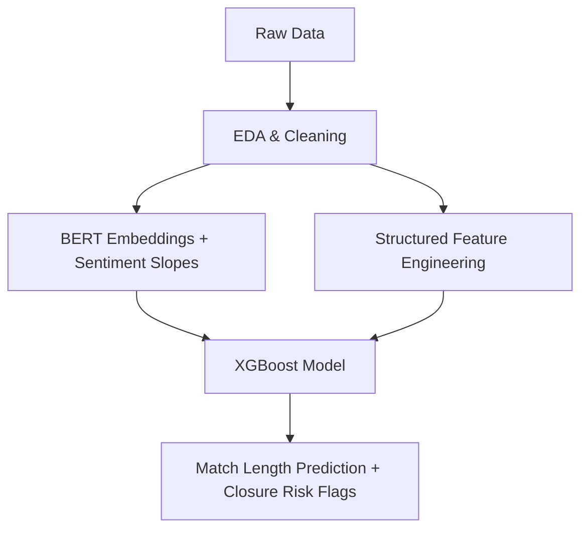

# 👥 MinneMUDAC 2025 Winners — Predicting Match Longevity for Big Brothers Big Sisters

🎉 We’re thrilled to share our **award-winning submission** for [MinneMUDAC 2025](https://minneanalytics.org/)!  
Our team, **We Push to Prod**, placed **2nd overall** for building an end-to-end machine learning pipeline to predict how long a volunteer mentorship match will last at **Big Brothers Big Sisters Twin Cities (BBBSTC)**.

---

## 🎯 Problem Statement

> Most mentorship matches end early, limiting long-term impact.  
> How can we predict match longevity and identify at-risk matches before they close?

---

## 📊 Dataset Overview

- **Structured data**: Match metadata, demographic attributes, census-level community features  
- **Unstructured data**: Match support notes, closure descriptions  
- **Source**: Provided by Big Brothers Big Sisters Twin Cities (BBBSTC)

---

## 🧠 Our Approach

### 1. 📌 Exploratory Analysis
- Matches with **>18 year age gap** lasted ~7 months longer
- **Ethnicity/gender alignment** boosted match longevity by ~5 months
- **Community-based programs** yielded longer matches vs. school-based

### 2. 💬 NLP & Sentiment Engineering
- Extracted **BERT embeddings** from match support notes  
- Computed **sentiment and emotional tone slopes** over last 3 check-ins  
- Mapped closure notes to **root reasons** using custom keyword clustering

### 3. 🔍 Predictive Modeling
- Target: Match length in **months**
- Baseline: Linear regression (RMSE: 17 months)
- Final model: **XGBoost**
  - RMSE: **10.2 months**
  - Features used:
    - Demographics (age diff, ethnicity match, gender match)
    - BERT sentiment/emotion slopes
    - Shared interests
    - Match type (community vs. school)

---

## 🔁 Solution Pipeline

## 🧭 Revamped Engagement Flowcharts for Coordinators

To improve early detection of at-risk matches, we developed a structured, decision-tree–based system for monthly check-ins. These trees guide match coordinators in identifying key issues and mapping them to root causes and intervention strategies.

---

### 🚫 Mentor Decision Tree – Not Currently Meeting

  

---

### ✅ Mentor Decision Tree – Currently Meeting

  

---

### 👥 Mentee Decision Tree

  

---

### 💡 Why This Matters

- Converts vague updates into structured data
- Links dropdown responses to root causes (e.g., time, health, or compatibility issues)
- Enables targeted **intervention strategies**
- Prevents silent disengagement by surfacing emotional and logistical blockers

---
## 🧠 Insights & Takeaways

- 📝 **Text sentiment over time** is a leading indicator of match breakdown.
- 👥 Matches under **optimal demographic conditions** lasted **7–9 months longer**.
- ✅ Our **redesigned mentor check-in questionnaire** helps identify high-risk closures early.

---

## 🛠 Tools & Stack

- 🐍 Python, Pandas, XGBoost
- 🤖 BERT (transformer embeddings)
- 🎭 Hartman Emotional Tone model
- 📊 SHAP, Seaborn, Scikit-learn
- 📽 PowerPoint (final slides)

---

## 🏆 Team: *We Push to Prod*

- **Justin Varghese** – Lead Data Scientist (Modeling, Feature Engineering)

---

## 📬 Contact

Built with ❤️ for social good and data science.  
Feel free to reach out to **Justin Varghese** for collaboration, mentorship, or speaking opportunities.

[🔗 GitHub Profile](https://github.com/blacckbeard4)
